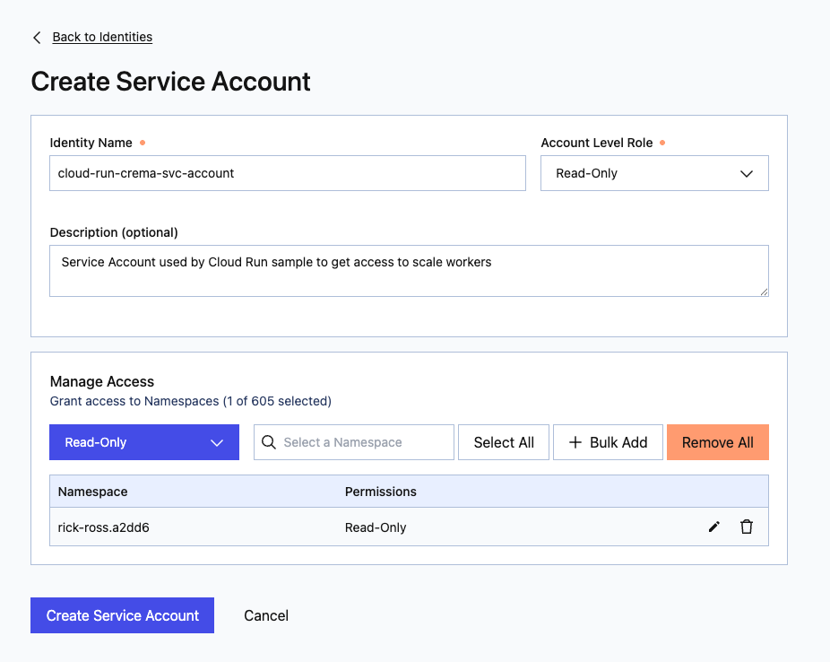
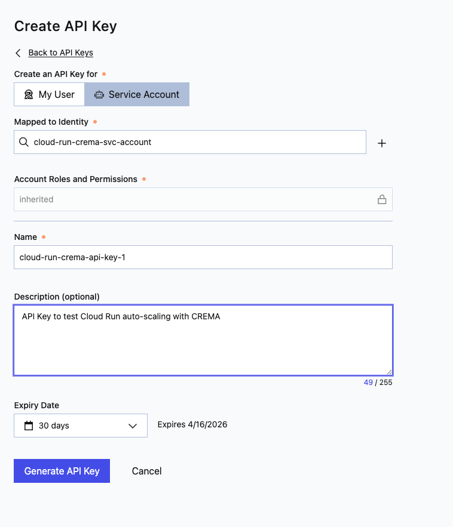
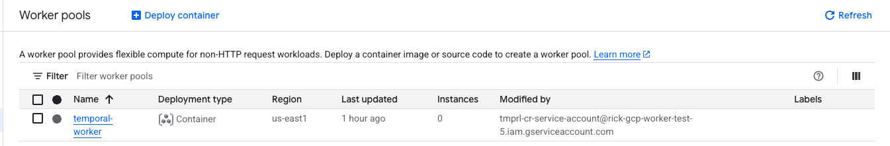
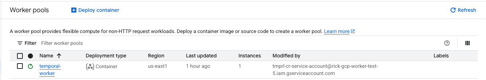

# Create a new GCP Project for the demo

Prerequisites
* [pulumi](https://www.pulumi.com/docs/install/)
* [gcloud](https://cloud.google.com/sdk/docs/install)

Clone this repository and run pulumi up.

```shell
git clone https://
cd /path/to/repo/cloud-run/gcp-infra
npm install
# Make sure you log in with your account that has sufficient permissions
gcloud auth application-default login 
pulumi up
```

Pulumi will prompt you to either choose a stack or enter a new one. 
Enter a new stack name, something like dev. 

Pulumi will complain that there is a missing configuration variable.

```shell
cp Pulumi.example.yaml Pulumi.<stack name>.yaml
```
Copy the example yaml file to your newly created stack name.

Now edit the file and enter the appropriate values. 

You need to specify either a _folderId_ or an _organizationId_. 
If both are specified, the folderId is used.

Also, be sure you specify your GCP Billing ID as this project uses resources 
that are not part of the free tier.  

When you are satisfied you have entered the correct values, re-run pulumi:

```shell
pulumi up
```

Answer yes if you are ready to create a new GCP project. Assuming there are
no errors, pulumi will create the necessary infrastructure for you.

When completed, Pulumi will display outputs, similar to this:

```text
Outputs:
  + cloudRunSvcAccountEmail: "tmprl-cr-service-account@rick-gcp-worker-test-2.iam.gserviceaccount.com"
  + runCloudBuildUI        : "cd ..; gcloud config set project rick-gcp-worker-test-2; gcloud builds submit . --config=cloudbuild-ui.yaml --substitutions=_REGION=us-east1,_REPOSITO..."
  + runCloudBuildWorker    : "cd ..; gcloud config set project rick-gcp-worker-test-2; gcloud builds submit . --config=cloudbuild-worker.yaml --substitutions=_REGION=us-east1,_REPO..."
  + serviceAccountEmail    : "tmprl-cr-service-account@rick-gcp-worker-test-2.iam.gserviceaccount.com"
  + serviceAccountFullName : "projects/rick-gcp-worker-test-2/serviceAccounts/tmprl-cr-service-account@rick-gcp-worker-test-2.iam.gserviceaccount.com"
  + serviceAccountShortName: "tmprl-cr-service-account"

```

The runCloudBuildUI output contains a script that submits a Cloud Build job to build the application 
and the Open Telemetry Collector and deploy them into Cloud Run. To see just the output of the runCloudBuild variable
run the following command:

```shell
pulumi stack output runCloudBuildUI
```
Take this output and paste it into your terminal or shell and hit enter. This kicks off the Cloud Build
job and will take a bit of time to provision the infrastructure.

Do the same thing for runCloudBuildWorker. Be sure you are in the gcp-infra/ folder.

```shell
cd gcp-infra/
pulumi stack output runCloudBuildWorker
```

Take this output and paste it into your terminal or shell and hit enter. This kicks off the Cloud Build 
job and will take a bit of time to provision the infrastructure. 

If you want to see the outputs again you can run the following command:

```shell
pulumi stack output
```

Next, we need to create a Temporal API Key that has READ access scoped to our namespace. 
In Temporal Cloud, navigate to Settings | API Keys and click the Create API Key button.
Select Service Account, click the plus Sign (next to Mapped to Identity) to Create a Service Account.

Give it name, like "cloud-run-crema-svc-account", select Read-Only for the Account Level Role.
You may put in a description if you would like.

IN the Manage Access section, select your namespace. The default is Read-Only permissions. 

Click Create Service account.



Next create an API Key that is mapped to the previously created service account. 
Give it a name and choose when the API key should expire (default is 30 days)



Open a terminal window and use the command below to send the key to Google Cloud Secret Manager, 
replacing "YOUR_TEMPORAL_API_KEY" with the key in your browser.

```shell
echo -n "YOUR_TEMPORAL_API_KEY" | gcloud secrets versions add temporal-api-key \
--project=<GCP PROJECT ID> \
--data-file=-
```

Note that you can create an API Key using tcld, but that tool is being deprecated. 

Finally, we need to restart the crema-autoscaler:

```shell
gcloud run services update crema-autoscaler \
    --region=us-east1 \
    --project=<GCP PROJECT ID> \
    --update-env-vars=RESTART=$(date +%s)

```
Navigate to Cloud Run | Worker Pools in Google Cloud Console. Notice that the number of instances for the temporal worker is showing zero.



y default, the application is not publicly visible. To access use the following command:

```shell
gcloud beta run services proxy temporal-metrics-ui --project <PROJECT_ID> --region <REGION>
```
Once the proxy is running, visit the application by navigating to [http://localhost:8080], 
enter some text and click the Run Workflow button. Feel free to do this more than one time.

Go back to Cloud Run | Worker Pools in Google Cloud Console. Note that the number if instances
on the worker is now set to one.



Now wait a few minutes and watch it scale back down to zero. 

For more details on the what is happening within the crema-autoscaler, you can look at the logs. 
An easy way to see these scaling changes is to filter by "[SCALER]"