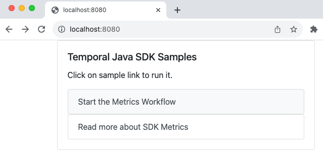
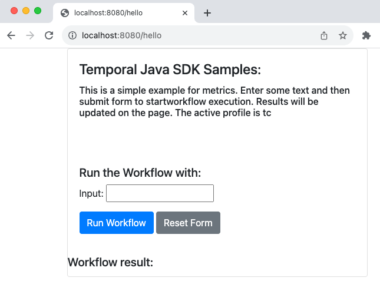
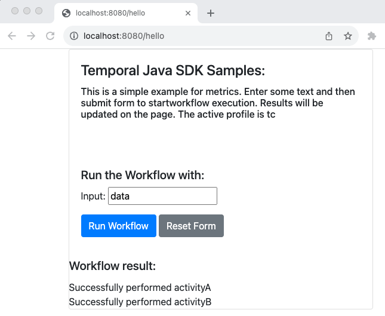
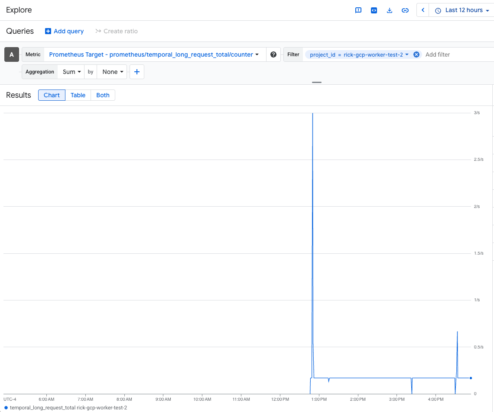
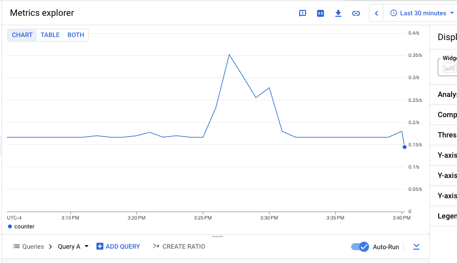

# Temporal on Cloud Run

This repository demonstrates how to run workers on [GCP's Cloud Run](https://cloud.google.com/run). 
Cloud Run is a serverless offering making it easier to deploy and run containerized applications. 
Initially Cloud Run was only for web based applications that responds to requests. Over time Cloud Run
has added the ability to run jobs as well. 

As awesome as Cloud Run is, there are some challenges that need to be addressed for applications that 
act as Temporal workers. One challenge is that Cloud Run is designed to run when requests are made, 
which provides a nice pay per use model. Unfortunately this doesn't play well with workers which long 
poll Temporal, waiting for work to process. 

The workaround for this is to disable [CPU Throttling](https://cloud.google.com/run/docs/configuring/cpu-allocation#setting). In YAML this looks like this:

```yaml
spec:
  template:
    metadata:
      annotations:
        run.googleapis.com/cpu-throttling: 'false'  # we need to keep the CPU running
```

Another challenge is that by default, an application running Cloud Run is scaled down to zero instances 
if there are no inbound web requests. This too, doesn't play well with Temporal workers.

The workaround for this is to set the [minimum number of instances](https://cloud.google.com/run/docs/configuring/min-instances#setting):

```yaml
spec:
  template:
    metadata:
      annotations:
        autoscaling.knative.dev/minScale: '1' # keep one instance available
```

Cloud Run only allows one port to be publicly exposed and exposing a Temporal SDK Metrics 
endpoint externally is not a good idea. Deploy the [Open Telemetry Connector](https://cloud.google.com/run/docs/tutorials/custom-metrics-opentelemetry-sidecar) in a 
[sidecar container](https://cloud.google.com/blog/products/serverless/cloud-run-now-supports-multi-container-deployments). 
The Open Telemetry Collector reads the Temporal SDK Metrics Prometheus scrape endpoint and can push 
the metrics (and optionally tracing and logging) to a destination of your choice. 

In this example, I chose to send the metrics to [Google Cloud Managed Prometheus](https://cloud.google.com/managed-prometheus).
The collector supports a wide range of other [exporters](https://opentelemetry.io/ecosystem/registry/?component=exporter) 
including Prometheus Remote Write Collector, Datadog, Splunk, Google Cloud Pubsub, Google Cloud Operations Collector. 
The full list of exporters are available [here](https://opentelemetry.io/ecosystem/registry/?component=exporter).

## Project Organization

The structure of this repository is laid out in the following manner

* [app](app/readme.md) - Sample Java application to deploy to Cloud Run
* [collector](collector) - Contains details for running the Open Telemetry Connector
* [gcp-infra](gcp-infra/readme.md) - [Pulumi](https://www.pulumi.com/) project to create a new GCP project

## How to Use this example

* Follow the steps listed in the [gcp-infra/readme](gcp-infra/readme.md). 
* Once the application has been deployed, you can access the application.

### Access via private

By default, the application is not publicly visible. To access use the following command:

```shell
gcloud beta run services proxy temporal-metrics-sample --project <PROJECT_ID> --region <REGION>
```
Once the proxy is running, visit the application by navigating to [http://localhost:8080]

### Make the Application Public

To access the application via its public URL, uncomment the last step in [cloudbuild.yaml](cloudbuild.yaml). 
Alternatively, you can run the following command:

````shell
gcloud run services set-iam-policy temporal-metrics-sample policy.yaml --region <REGION>
````

To retrieve the public URL run the following command:

````shell
gcloud run services describe temporal-metrics-sample --region <REGION> --format='value(status.url)'
````

### Start the Workflow

Using the appropriate URL, (see the section above), navigate to application. You should see the following page:



Click on the Start the Metrics Worfklow



Enter some text for the input and click the Run Workflow button. This will start the workflow. After about 30 seconds, the workflow will complete:



The application purposefully fails the activity for a few times before completing so that there are interesting metrics.

Start the workflow a couple of more times to get a few more executions. 

Open up the Temporal Cloud console, by navigating to [https://cloud.temporal.io](https://cloud.temporal.io) to view the progress of the workflows.

### View Metrics in Google Cloud Monitoring

Open the [Metrics Explorer](https://console.cloud.google.com/monitoring/metrics-explorer) in Google Cloud Console. In 
the Metric drop down, scroll down to Prometheus Target, Temporal and click on Prometheus/temporal_long_request_total/counter 
and click on the Apply button.



Now in the time box near the upper right of the screen, click the down arrow and select Last 30 Minutes. You should see 
a graph that looks similar to this one:



Feel free to experiment adding additional metrics.


## Latest Updates - 12-19-2024

The application was modified to generate a unique Workflow ID and to return the input parameter in the output 
of the workflow. Also changed was the parameter of the application from a string to a Java Object.

Spring Boot and Temporal SDK versions was updated to reflect latest versions at the time. The node versions 
in the [gcp-infra](gcp-infra) file were also updated to address vulnerabilities.

Building the container with Docker was revised since the previous version was reliant on a deprecated openjdk8 version. 
The new version builds a JRE with only the modules being used by the application.  

In the [run-service.yaml](run-service.yaml), it was modified to add a "date_updated" label that is changed on 
each deployment to Cloud Run. This is because Cloud Run is declarative and will only deploy a new revision if 
certain values change in the yaml file. Since we are rebuilding the Java application every single time (a 
better approach would be to pull directly from git), this effectively forces a new revision. 

In the [cloudbuild.yaml](cloudbuild.yaml) file, the label is updated to the current date and time. Due to 
strict naming rules, the format of this is "was_YYYY-MM-DD_HH_MM_SS"   

The [readme.md](gcp-infra/readme.md) has been updated to include some missing steps.


