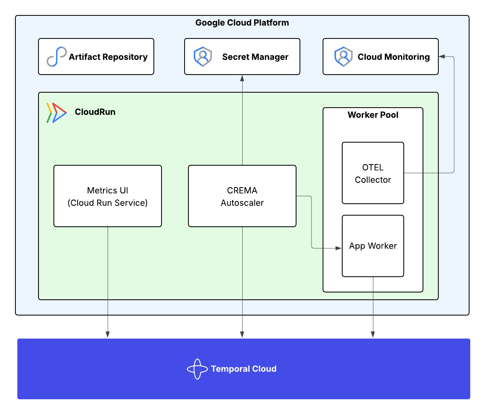
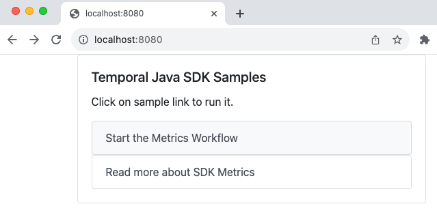
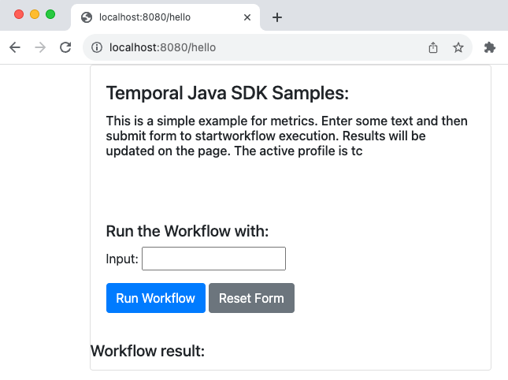
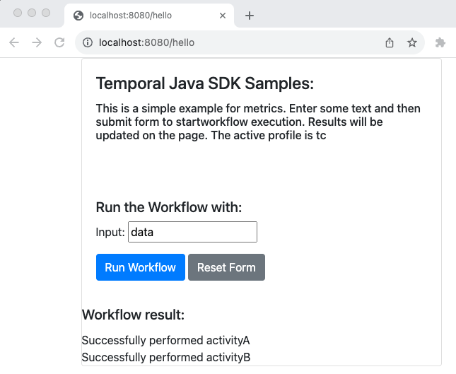
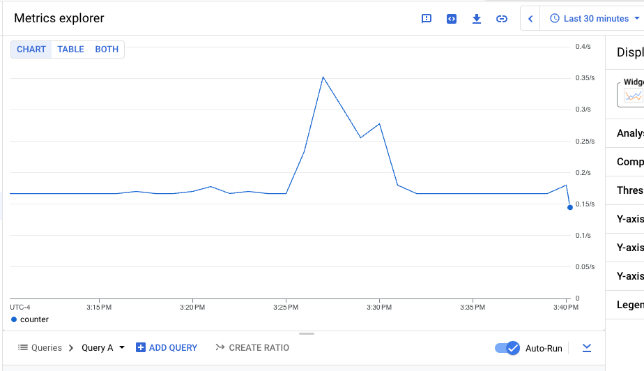

# Temporal on Cloud Run

This repository demonstrates how to run workers on [GCP's Cloud Run](https://cloud.google.com/run). 

Google Cloud Run has launched Worker Pools, a new resource type specifically designed 
for performing continuous background work, which is a better fit for running Temporal 
Workers on Cloud Run. Additionally, the Cloud Run team has introduced CREMA, 
(Cloud Run External Metrics Autoscaling), which can be used to scale worker pools 
based on external metrics, and even scale to zero! This repository updates guidance on 
worker deployment best practices based on the latest capabilities in Cloud Run.

Unlike Kubernetes, Google Cloud Run makes it trivial to deploy container-based applications. 
Have a web API that you want to deploy? Package it up in a container and let Cloud Run take 
over provisioning the underlying infrastructure, load balancer, and DNS endpoint, and your 
application is ready to receive traffic. As traffic to your popular API goes up and down, 
Cloud Run automatically scales based on the inbound traffic and CPU utilization. It’s truly 
amazing how easy it is to deploy, run, and scale web-based applications.

Temporal Worker applications, however, operate differently. They long-poll Temporal Cloud 
and process tasks as they become available. This is a much better match for [worker pools](https://docs.cloud.google.com/run/docs/deploy-worker-pools), 
which was purposefully designed to handle continuous background work. Worker pools do not 
have a publicly exposed port or use a load balancer like Cloud Run Services. They also do 
not support auto-scaling.

To scale worker pools, Google provides [Cloud Run External Metrics Autoscaling](https://docs.cloud.google.com/run/docs/configuring/workerpools/crema-autoscaling) 
(CREMA), which leverages [Kubernetes-based Event Driven Autoscaling](https://keda.sh/) (KEDA) 
to scale worker pools based on external metrics such as [Approximate Backlog Count](https://docs.temporal.io/develop/worker-performance#ApproximateBacklogCountAndAge) 
from a Temporal Task Queue. It follows the specification outlined [here](https://keda.sh/docs/2.17/scalers/temporal/).

Cloud Run only allows one port to be publicly exposed and exposing a Temporal SDK Metrics 
endpoint externally is not a good idea. Deploy the [Open Telemetry Connector](https://cloud.google.com/run/docs/tutorials/custom-metrics-opentelemetry-sidecar) in a 
[sidecar container](https://cloud.google.com/blog/products/serverless/cloud-run-now-supports-multi-container-deployments). 
The Open Telemetry Collector reads the Temporal SDK Metrics Prometheus scrape endpoint and can push 
the metrics (and optionally tracing and logging) to a destination of your choice. 

In this example, I chose to send the metrics to [Google Cloud Managed Prometheus](https://cloud.google.com/managed-prometheus).
The collector supports a wide range of other [exporters](https://opentelemetry.io/ecosystem/registry/?component=exporter) 
including Prometheus Remote Write Collector, Datadog, Splunk, Google Cloud Pubsub, Google Cloud Operations Collector. 
The full list of exporters are available [here](https://opentelemetry.io/ecosystem/registry/?component=exporter).

## Project Organization

The structure of this repository is laid out in the following manner

* [app-ui](app-ui/readme.md) - Sample Java application to deploy to Cloud Run
* [app-worker](app-worker/readme.md) - Java application that contains the Worker, Temporal SDK and emits metrics
* [collector](collector) - Contains details for running the Open Telemetry Connector
* [gcp-infra](gcp-infra/readme.md) - [Pulumi](https://www.pulumi.com/) project to create a new GCP project

## Application Architecture

The following diagram shows every major component of this example.  There is the application UI which is deployed
as a standard Cloud Run service, a Temporal Worker and an OTEL collector that is deployed as a Cloud Run Worker Pool,
and a CREMA autoscaler that looks at the Approximate Backlog Count and scales the worker up and down.



## How to Use this example

* Follow the steps listed in the [gcp-infra/readme](gcp-infra/readme.md). 
* Once the application has been deployed, you can access the application.

### Access via private

By default, the application is not publicly visible. To access use the following command:

```shell
gcloud beta run services proxy temporal-metrics-ui --project <PROJECT_ID> --region <REGION>
```
Once the proxy is running, visit the application by navigating to [http://localhost:8080]

### Make the Application Public

To access the application via its public URL, uncomment the last step in [cloudbuild-ui.yaml](cloudbuild.yaml). 
Alternatively, you can run the following command:

````shell
gcloud run services set-iam-policy temporal-metrics-ui policy.yaml --region <REGION>
````

To retrieve the public URL run the following command:

````shell
gcloud run services describe temporal-metrics-ui --region <REGION> --format='value(status.url)'
````

### Start the Workflow

Using the appropriate URL, (see the section above), navigate to application. You should see the following page:



Click on the Start the Metrics Worfklow



Enter some text for the input and click the Run Workflow button. This will start the workflow. After about 30 seconds, the workflow will complete:



The application purposefully fails the activity for a few times before completing so that there are interesting metrics.

Start the workflow a couple of more times to get a few more executions. 

Open up the Temporal Cloud console, by navigating to [https://cloud.temporal.io](https://cloud.temporal.io) to view the progress of the workflows.

### View Metrics in Google Cloud Monitoring

Open [Monitoring | Metrics Management](https://console.cloud.google.com/monitoring/metrics-management/metrics) in Google Cloud Console.
in the filter, you can type temporal and hit enter. The list of metrics will be filtered to those emitted by the SDK. 
Find temporal_long_request_total/counter in the list. Scroll to the right to the three vertical dots, click the actions 
and view this in the Metrics Explorer. 

Now in the time box near the upper right of the screen, click the down arrow and select Last 30 Minutes. You should see 
a graph that looks similar to this one:



Feel free to experiment adding additional metrics.

## Latest Updates - March 2026

With the latest addition of Worker Pools and CREMA Scaling, this repository has been updated to 
reflect how to deploy a Worker Pool and leverage CREMA for scaling Temporal. The application has
been split into two separate apps - one for the UI and another for the Worker. The worker still 
uses a sidecar to send the SDK metrics to Google Managed Prometheus.

Changes have also been made to the Pulumi automation within the [gcp-infra](gcp-infra/readme.md) folder.
there are separate cloudbuild scripts for the UI and the Worker and two deployment files for running
the UI [run-service.yaml](run-service.yaml) and the Worker Pool [run-workerpool.yaml](run-workerpool.yaml)

